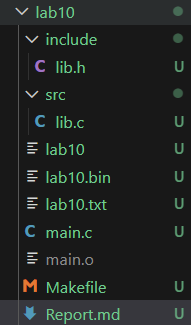

# Lab 10 — Files in C. Text and Binary Files
 
---
**Course:** Programming, Part 1  
**Institution:** NTU KhPI, Kharkiv, Ukraine  
**Student:** Arina Hryshko  
**Date:** November 28, 2025  
 **Variant:** 11(eleven)

---
 
## Task Description

```
General Task: Smartphone inventory. Model, manufacturer, storage size, price. Search by manufactures; delete discontinued models; append new models. 

```

**Task 1: Operations with Text Files.**
1. Define the structure of a record.
2. Create a text file:
   - Input records from the keyboard.
   - Write them to the file.
3. Implement functions to:
   - Print all records.
   - Search records by a key.
   - Delete records meeting a condition.
   - Append new records at the end.
4. Create a menu to call these operations.
5. Include error cheking for file operations.

**Task 2: Operations with Binary Files**
1. Create an array of structures in memory.
2. Fill the array with test data.
3. Write the array to a ".bin" file using "fwrite".
4. Impplement functions to:
   - Read all records into memory.
   - Print records.
   - Search records by a condition.
   - Append new records.
5. Use either full file rewrite or a temporary file for deletions.
6. Provide a menu similar to Task 1

## Structure
 
```
lab10/
├── include/
|  └── lib.h           # Header file for library function
├── src/               # Implementation files
|  └── lib.c           #Implementation of library functions
├── test/
|  └── test_lib.c      # Unit tests for library functions
├── Unity/             # Unity testing framework 
|  └── src/
|  |  └──   unity.c    #Unity source file
|  └── include/
|     └──   unity.h    #Unity header file 
├── lab10.bin          #Binary file
├── lab10.txt          #Text file
├── main.c             #Main application file
├── Makefile           #Build file
└── Report.md          #Project documentation
```
 
## Lab Instructions
 
**Task 1: Operations with Text Files.**
1. Create the structure and format of a text record
2. Implement the creation of a text file (enter entries from the keyboard; write to a file)
3. Implement functions (display all records; search by key; delete by condition; add new records)
4. Create a menu to call these operations.
5. Add error checking (fopen).

**Task 2: Operations with Binary Files**
1. Create an array of structures and fill it with test data.
2. Write the entire array to a binary file using fwrite.
3. Implement (reading all records from a file; outputting records; searching by condition; deleting; adding new records to the end of the file)
4. Create a menu similar to Task 1. 

### How to Build include/lib.h
 

```bash
#ifndef LIB_H_
#define LIB_H_

#define MAX_MANUFACTURER_LEN 30
#define MAX_MODEL_LEN 70

typedef struct Smartphone
{
    char manufacturer[MAX_MANUFACTURER_LEN];
    char model[MAX_MODEL_LEN];
    int storage_gb;
    float price;
} Smartphone;

// task 1(.txt)
int create_text_file(const char *filename);
void print_smartphone(const Smartphone *s);
int print_all_text(const char *filename);
int find_text_by_manufacturer(const char *filename, const char *key);
int delete_model(const char *original_file);

// task 2(.bin)

int write_binary_array(const char *filename, Smartphone *arr, size_t count);
int read_binary_array(const char *fileman, Smartphine **arr_ptr, size_t *count_ptr);

#endif //LIB_H

```

 
 ### How to Build src/lib.c

```bash
#include <lib.h>
#include <stdio.h>
#include <stdlib.h>
#include <string.h>

// task 1(.txt)
int create_text_file(const char *filename) {
    FILE *f = fopen("lab10.txt", "w");
    if(!f) {
        perror("fopen failed"); // cheking problem
        return 0;
    }
    fprintf(f, "%s %s %d %.2f\n", "Apple", "Iphone 15", 128, 40000.00);
    fprintf(f, "%s %s %d %.2f\n", "Xiaomi", "Xiaomi 15T Pro", 256, 28000.00);
    fprintf(f, "%s %s %d %.2f\n", "POCO", "POCO F7", 256, 17000.00);

    fclose(f);
    return 1;
}

// task 2(.bin)
int write_binary_array(const char *filename, Smartphone *arr, size_t count) {
    FILE *f = fopen("lab10.bin", "wb");
    if(!f) {
        perror("fopen failed");
        return 0;
    }
    if(fwrite(arr, sizeof(Smartphone), count, f) != count){
        perror("fwrite failed");
        fclose(f);
        return 0;
    }
    fclose(f);
    return 1;
}
```

 ### How to Build main.c

 ```bash
#include <stdio.h>
#include <stdlib.h>
#include <string.h>

typedef struct Smartphone {
    char brand[10];
    char model[80];
    int memory;
    double price;
} Smartphone;

// task 1(.txt)
int create_text_file(const char *filename) {
    FILE *f = fopen("lab10.txt", "w");
    if(!f) {
        perror("fopen failed"); // cheking problem
        return 0;
    }
    fprintf(f, "%s %s %d %.2f\n", "Apple", "Iphone 15", 128, 40000.00),
    fprintf(f, "%s %s %d %.2f\n", "Xiaomi", "Xiaomi 15T Pro", 256, 28000.00),
    fprintf(f, "%s %s %d %.2f\n", "POCO", "POCO F7", 256, 17000.00),

    fclose(f);
    return 1;
}

// task 2(.bin)
int write_binary_array(const char *filename, Smartphone *arr, size_t count) {
    FILE *f = fopen("lab10.bin", "wb");
    if(!f) {
        perror("fopen failed");
        return 0;
    }
    if(fwrite(arr, sizeof(Smartphone), count, f) != count){
        perror("fwrite failed");
        fclose(f);
        return 0;
    }
    fclose(f);
    return 1;
}

//main
int main () {
    if(!create_text_file("lab10.txt")) {
        printf("Error: in writing the text\n");
        return 1;
    }
    printf("text file 'lab10.txt' written successful\n");

    // .bin file
    Smartphone phones[3] = {
        {"Apple", "Iphone 15", 128, 40000.00},
        {"Xiaomi", "Xiaomi 15T Pro", 256, 28000.00},
        {"POCO", "POCO F7", 256, 17000.00},
    };
    if(!write_binary_array("lab10.bin", phones, 3)) {
        printf("Error: writing binary file\n");
        return 1;
    }
    printf("Binary file 'lab10.bin' writtet successful\n");
    return 0;
}
 ```

 ### How to Build Makefile

 ```bash
CC = gcc
CFLAGS = -Wall -Wextra -std=c11
TARGET = lab10

all: $(TARGET)

$(TARGET): main.o
	$(CC) $(CFLAGS) -o $(TARGET) main.o

main.o: main.c
	$(CC) $(CFLAGS) -c main.c

clean:
	rm -f *.o $(TARGET) lab10.txt lab10.bin
 ```
 

### How to Run Tests
 
 ```bash
gcc -Wall -Wextra -std=c11 -o lab10_exec main.o
grishko4210@DESKTOP-VOL6J04:~/programming-part-1/lab10$ ./lab10
text file 'lab10.txt' written successful
Binary file 'lab10.bin' writtet successful

 ```
 ### Test Results

 **Text file:**

 ```bash
Apple Iphone 15 128 40000.00
Xiaomi Xiaomi 15T Pro 256 28000.00
POCO POCO F7 256 17000.00
 ```

**Binary Files:**

 

---
 
 ## Report
 
The goal of this lab is to learn how to work with text and binary files in the C programming language: openinh files in different modes, reading and writing data, navigating in files, and modifying file content(search, deletion, insertion, append).
 
In this lab, I completed the following tasks:
1. Defined a data structure to represent records
2. Implemented creation of a text file with user-entered records.
3. Implemented operations on text files:
 - printing all records;
 - searching by a given key;
 - deleting records that match a condition;
 - appending new records at the end.
4. Implemented creation of a binary file from an array of structures using fwrite.
5. Implemented operations on binary files:
 - reading all records with fread;
 - printing data in readable format;
 - deleting records using file rewriting or a temporary file;
 - appending new records using binary write mode.
6. Added menu-driven interaction for both tasks.
7. Added file-operation error checking (fopen).
 
TBD
 
---

### Observations and Conclusion
 
During the lab, I learned how text and binary files differ in structure, storage, and access. Text files are human-readable but require formatting and parsing, while binary files store data in a compact structured form suitable for direct reading into memory. I practiced:
1. Opening files in different modes (r, w, a, rb, wb, ab);
2. Safely reading and writing structured data;
3. Handling errors in file operations;
4. Organizing modular code with separate functions.

This lab improved my understanding of file handling in C and demonstrated the advantages and limitations of both text and binary formats.
 
TBD
 
---