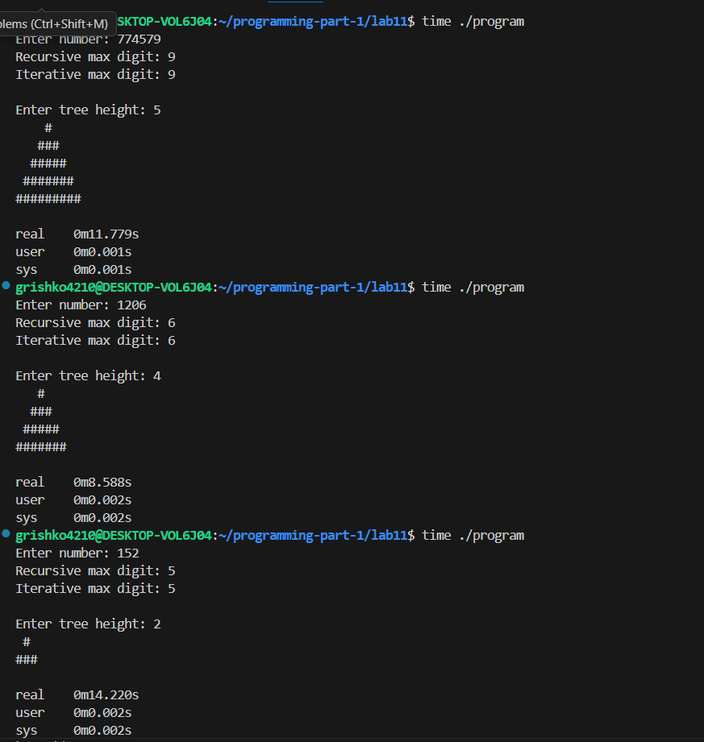

# Lab 11 — Recursion
 
---
**Course:** Programming, Part 1  
**Institution:** NTU KhPI, Kharkiv, Ukraine  
**Student:** Arina Hryshko   
**Date:** November 29, 2025   
**Variant:** 11(eleven) 

---
 
## Task Description

Each student must solve one task from each category using recursion:

***Recursive Calsulation Task:***
Find the maximum digit in a number n recursively.

***Recursive Symbol Drawing Task:***
Draw a "tree" shape with height n, where each level contains an icreasing number of rows.
## Structure
 
```
lab11/
├── include/
|  └── lib.h           # Header file for library function
├── src/               # Implementation files
|  └── lib.c           # Implementation of library functions
├── main.c             # Main application file
├── Makefile           # Build file
└── Report.md          # Project documentation

```
 
## Lab Instructions
 
1. Recursive Calculations - Tasks that require recursive computations with numbers.
2. Recursive Symbol Drawing - Tasks that involve drawing shapes and patterns with characters.
 
### How to Build include/lib.h
 

 
```bash
#ifndef LIB_H_
#define LIB_H_

// task1
int max_number(int n);
int max_number_iterative (int n);
// task2
void draw_tree(int n);
void print_row_recursive(int count, char symbol);
void draw_tree_recursion(int n, int level);

#endif

```
 
### How to Build src/lib.c

 ```bash
#include <stdio.h>
#include "lib.h"

int max_number(int n) {
    if(n < 10) return n;  // Base case
    int last = n % 10;
    int best = max_number (n / 10);  // Recursive call
    return (last > best) ? last : best;
}
int max_number_iterative (int n) {
    int max = 0;
    while (n > 0) {
        int d = n % 10;
        if (d > max) max = d;
        n /= 10;
    }
    return max;
}

// task 2
void print_row_recursive(int count, char symbol) {
    if (count <= 0) return;  // Base case
    printf("%c", symbol);
    print_row_recursive(count - 1, symbol);
}

// Recursion tree
void draw_tree_recursion(int n, int level) {
    if (level > n) return;
    int spaces = n - level;
    int stars = level * 2 - 1;
    print_row_recursive(spaces, ' ');
    print_row_recursive(stars, '#');
    printf("\n");
    draw_tree_recursion(n, level + 1);
}

void draw_tree(int n) {
    draw_tree_recursion(n, 1);
}

 ```

 ### How to Build main.c

  ```bash
#include <stdio.h>
#include "lib.h"

int main() {
    int n;

    // Task 1
    printf("Enter number: ");
    scanf("%d", &n);

    int r1 = max_number(n); 
    int r2 = max_number_iterative(n);

    printf("Recursive max digit: %d\n", r1);
    printf("Iterative max digit: %d\n", r2);

    // Task 2
    printf("Enter tree height: \n");
    scanf("%d", &n);

    draw_tree(n);

    return 0;
}

  ```

 ### How to Build Makefike

  ```bash
CC = gcc
CFLAGS = -Wall -Iinclude

SRC = src/lib.c main.c
OBJ = $(SRC:.c=.o)
TARGET = program

all: $(TARGET)

$(TARGET): $(OBJ)
	$(CC) $(OBJ) -o $(TARGET)

clean:
	rm -f $(OBJ) $(TARGET)

  ```
### How to Run Tests

 
```bash
make
./program
time ./lab11

```
### Test Results


 
---
 
## Report
 
The goal of this lab is to practice using recursion in C to solve computational and graphical problems, and to understand how recursive functions can replace iterative loops for certain tasks.

In this lab, I completed the following tasks:
1. Recursive Calculation Task:
2. Implemented a recursive function max_number(int n) to find the maximum digit in a given number.
3. Implemented an iterative version max_number_iterative(int n) to compare results and verify correctness.

**Recursive Symbol Drawing Task:**

1. Implemented a recursive function draw_tree(int n) that prints a tree of height n.
2. Used a helper recursive function print_row_recursive(int count, char symbol) to print each row of symbols.
3. Ensured that the tree was symmetric and each level contained the correct number of symbols.
 
---
 
### Observations and Conclusion
 
**Observations:**

1. The recursive max_number function correctly identifies the largest digit in any positive integer.
2. The iterative version produces identical results, confirming the correctness of the recursive solution.
3. The recursive tree drawing function produces a visually correct and symmetric tree, demonstrating how recursion can simplify pattern generation.
4. Base cases are crucial in recursion to prevent infinite loops and ensure correct termination.

**Conclusion:**
Understanding recursive logic and base cases improves both problem-solving skills and programming discipline.
The lab reinforced the concept of using recursion in C, highlighted differences between recursive and iterative approaches, and provided practice in structuring clean, modular code.
 
---
