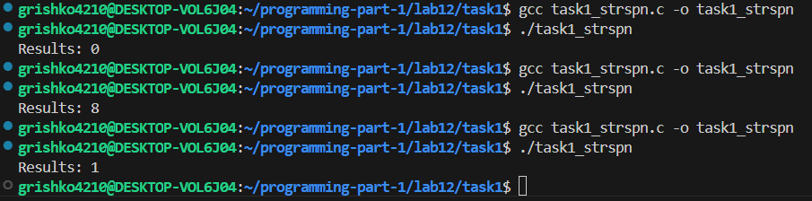
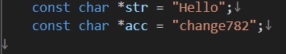
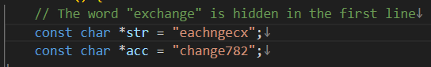
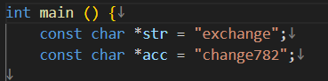
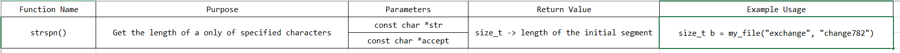
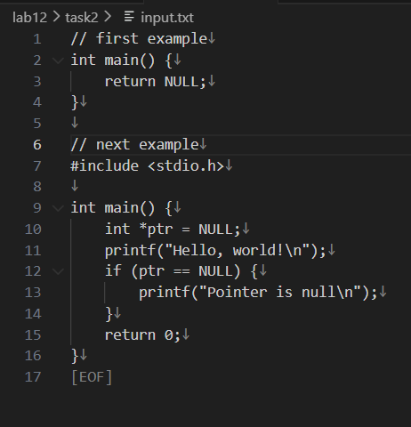
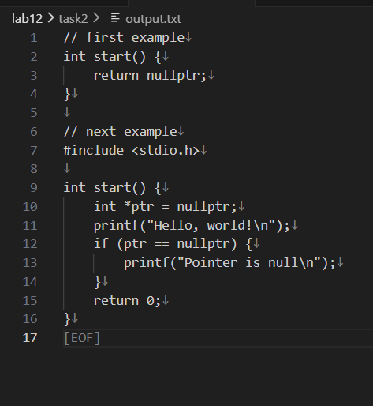

# Lab 12 — Working with C-Strings and File Operations
 
---
**Course:** Programming, Part 1  
**Institution:** NTU KhPI, Kharkiv, Ukraine  
**Student:** Arina Hryshko  
**Date:** November 30, 2025  
**Variant:** 11(eleven)
 
---
 
## Task Description
 
**Task 1: Implemment a Standard C-String Function.**

```
In this task, implement one of the standard C-String functions from scratch, without using the "<string.h>" library.
Function: strspn() - Get the length of a substring cosisting only pf specified characters.
 ```

**Task 2: File Operations and String Manipulation**

```
In this task, write a program that reads data from an input file, modifies specific strings according to the assigned requirements, and saves the modified data to an output file.

String Modification 1: Change "main()" to "start()".    
String Modification 2: Replace ane "NULL" with "nullptr".
```

## Structure
 
```
lab12/
├── task1/
|   └── task1_strspn.c  # Implementation of Task 1:
├── task2/
|   └── input.txt       # Input file for Task 2
|   └── output.txt      #Output file after processing Task 2
|   └── task2_change.c  #Task 2 program
└── Report.md           # Project documentation
```
 
## Lab Instructions
 
For 1 task:
1. Choose your variant and write a small program to test ypur function with different inputs.
2. Complete the table for your functions.

For 2 task:
1. Write a program that opens a text file for reading(e.g., "input.txt").
2. Split program to functions.
3. Read the contents of the file line-by-line or as a full dump.
4. Perform string modifications as assigned to your variant.
5. Save the modified contents to an output file(e.g., "output.txt").
6. Test the program to ensure it accurately applies the specified string changes and saves the results correctly.
 
### How to Build (task1):
 
 
```bash
#include <stdio.h>

size_t my_file(const char *str, const char *accept) {
    const char *s = str;
    const char *a;

    size_t count = 0;

    while (*s) {
        a = accept;
        int match = 0;

        while (*a) {
            if(*s == *a) {
                match = 1;
                break;
            }
            a++;
        }
        if(!match)
        break;
        count++;
        s++;
    }
    return count;
}

// main
int main () {
    const char *str = "exchange";
    const char *acc = "change782";

    size_t b = my_file(str, acc);
    printf("Results: %zu \n", b);
    return 0;
}
```
 
### How to Run Tests (task1)
 
 
```bash
gcc task1_strspn.c -o task1_strspn
./task1_strspn
```
### Test Results (task1)
 

 
But the meanings change because we change the word. For example, 

---
  

---
 

---


---
### Runtime Output
 
| Input str | Input accept | Result |
|-----------|--------------|--------|
|   Hello   |  change782   |    0   |
|  eachngcx |  change782   |    8   |
|  exchange |  change782   |    1   |

 ### Table for the firs task


 
 
---


 

### How to Build (task2):

```bash
#include <stdio.h>
#include <stdlib.h>

#define MAX_LINE 512

int find_substring(const char *line, const char *old) {
    int i = 0, j;
    if (!*old) return 0;
    while (line[i]) {
        j = 0;
        while (line[i+j] && old[j] && line[i+j] == old[j])
            j++;
        if (!old[j])
            return i;
        i++;
    }
    return -1;
}

void change(char *line, const char *old, const char *new) {
    char buffer[MAX_LINE];
    int pos;

    while ((pos = find_substring(line, old)) != -1) {
        int i=0, k=0;

        // Copy everything to old
        for(i=0; i<pos && k<MAX_LINE-1; i++)
            buffer[k++] = line[i];

        // Copy new
        for(i=0; new[i] && k<MAX_LINE-1; i++)
            buffer[k++] = new[i];

        int old_len=0;
        while(old[old_len]) old_len++;

        for(i=pos+old_len; line[i] && k<MAX_LINE-1; i++)
            buffer[k++] = line[i];

        buffer[k]='\0';

        i=0;
        while(buffer[i]) {
            line[i] = buffer[i];
            i++;
        }
        line[i] = '\0';
    }
}

int main() {
    FILE *input = fopen("input.txt","r");
    if(!input) {
        perror("Error: File cannot be opened input.txt\n");
        return 1;
    }

    FILE *output = fopen("output.txt","w");
    if(!output) {
        perror("Error: File creation isn't possible output.txt\n");
        fclose(input);
        return 1;
    }

    char line[MAX_LINE];

    while(fgets(line, MAX_LINE, input)) {
        // main --> start
        change(line, "main()", "start()");
        // NULL --> nullptr
        change(line, "NULL", "nullptr");
        fputs(line, output);
    }

    fclose(input);
    fclose(output);

    printf("The result is ready, to view go to output.txt\n");
    return 0;
}

```
 
 ### How to Run Tests (task2):

 ```bash
gcc task2_change.c -o task2_change
./task2_change
The result is ready, to view go to output.txt

```
 
 ### Test Results (task1)

 ---


 ---


---

## Report
 
The goal of this lab is to practice working with C-strings without using the standard "<string.h>" library, as well as to learn how to process text files in C, perform string modifications, and save results to a new output file. The lab helps to strengthen understanding of low-level string operations
In this lab, I completed the following tasks:
1. Implemented a custom version of the standard C function strspn() without using "<string.h>".
2. Created a test program that checks the function with different input data and recorded the results in a table.
3. Implemented file-processing functionality that reads text from input.txt, performs two types of string replacements—"main()" --> "start()" and "NULL" --> "nullptr" and writes the modified data into output.txt.
4. Split the program into smaller functions (int find_substring() and void change()) to improve structure and readability.
5. Fully tested both programs to ensure correct functionality.
 
---
 
### Observations and Conclusion
 
During this lab, I improved my understanding of how C-strings work internally by implementing string functions without using "<string.h>". I also gained practical experience with file operations: reading files, modifying text, and writing results safely. Both tasks worked correctly, and the lab helped strengthen my skills in low-level string processing and file handling in C.
 
---
