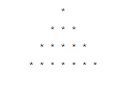
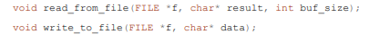
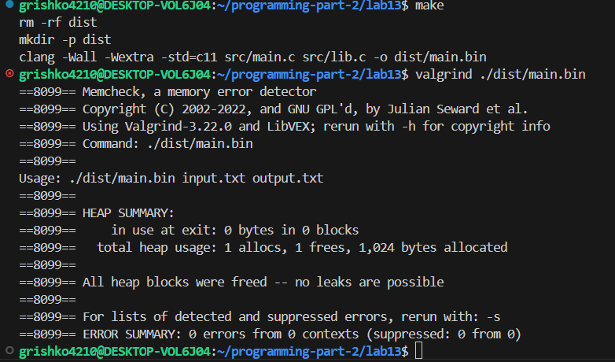
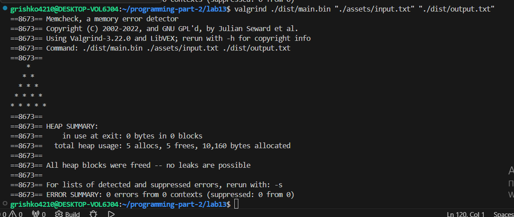
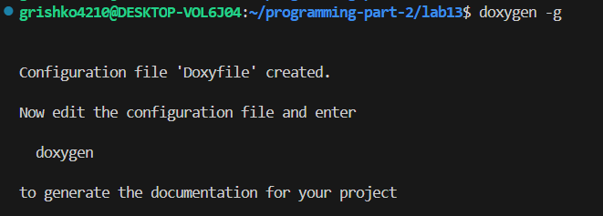
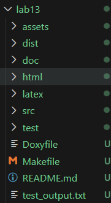
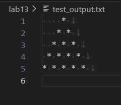
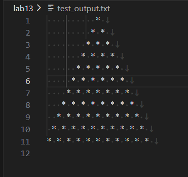
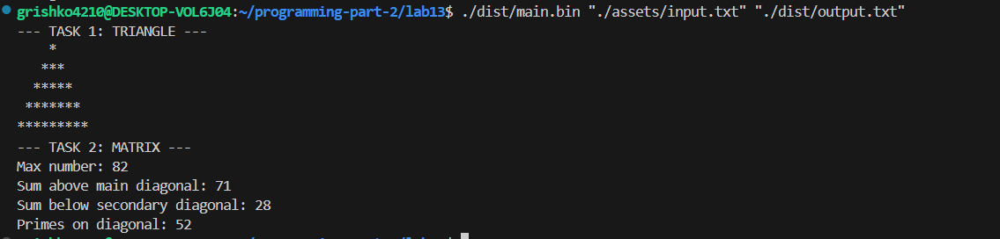

# Lab 13 — Lab Work Working with files
 
---
**Course:** Programming, Part 2  
**Institution:** NTU KhPI, Kharkiv, Ukraine  
**Student:** Arina Hryshko  
**Date:** 11 April, 2026
 
---
 
## Task Description
 
### General task:
```
1. Initial data was input from a file;
2. Output of the resulting data was carried out not only to the console, but also to a file (but it should not be in the version control system).
3. The name of the input file and the resulting file should be obtained from the user using the application arguments;
4. Work with the file should be used using the fprintf() and fscanf(); functions
5. It is expected that when starting the program with command line parameters, nothing will be expected from the user
```
### Individual tasks:

```
Develop a program that creates a solid isosceles triangle from a given file of given symbols (e.g., asterisks). The height of the triangle, the placeholder symbol, and the width of the base are given in the input file. For example, with a height of 4, a width of 7, and a placeholder of *, the result in the file should be as follows.
```


## Structure
 
```
lab13/
├──Doxyfile/
├── Makefile/
├── README.md
├── assets/
|      └── input.txt
├── test/
|      └── test.c
├── doc/
|      └── lab13.md
├── src/
|     └── lib.c
|     └── lib.h
|     └── main.c
```
 
## Lab Instructions
 
Recommendations for (example) prototypes of file handling functions:



### Additional mandatory conditions for the work:

- The program must have documentation, formatted using the doxygen utility;
- The report must be formatted according to the “Requirements for structural report construction”;
- Demonstrate the absence of memory leaks using the valgrind utility;
- Access to array elements should be carried out through pointer dereferencing, and not through
37
the indexing operator ([ ]);
- Demonstrate the operation of the developed methods using unit tests;
- Indicate the degree of code coverage by unit tests in the report. 50% is the minimum allowable
percentage of code coverage by tests

### How to Build (lib.h)
  
```bash
#ifndef LIB_H
#define LIB_H

#include <stdio.h>
#include <stdlib.h>
// Task
int read_task(FILE *file);

// Triangle
void write_triangle(FILE *file, int h, char sym);

// Matrix
void read_matrix(FILE *file, int ***a, int *h, int *w);
void free_matrix(int **a, int h);

// Options
int find_max(int **a, int h, int w);
int sum_above_main(int **a, int h, int w);
int sum_below_secondary(int **a, int h, int w);

// Simple Number
int is_simple(int a);
void print_simple_on_diag(FILE *file, int **a, int h, int w);

#endif
```

### How to Build (lib.c)

```bash
#include <stdio.h>
#include <stdlib.h>
#include "lib.h"

// Triangle
void write_triangle(FILE *file, int h, char sym) {
    for(int i = 1; i <= h; i++) {
        for (int j = 1; j <= h - i; j++) {  // Spaces
            fprintf(file, " ");
        }
        for (int j = 1; j <= 2 * i - 1; j++) {  // Symbols
            fprintf(file, "%c", sym);
        }
        fprintf(file, "\n");
    }

}

```

### How to Run Tests
 
```bash
make test
./dist/test.bin
make clean
```
## Checking(valgrind):

*1*


*2*


## How to Build(Doxygen):

*1*


*2*


### Test Results
 
*1*


*2*


*3*


---
 
 
## Report
 
The goal of this lab is to learn how to work files in the C programming language, including reading data from a file and writing results to another file usiing standard file functions.
 
In this lab, I completed the following tasks:
- Created a program that reads input data(height,  width ad symbol) from a file;
- Used the following functions (fprintf) abd (fscanf);
- Checked the program for memory leaks;
 
TBD
 
---
 
### Observations and Conclusion
 
*Observations:* During this lab, I learned how to work with files in the C language, including reading input data from a file and writing results to another file using the (fprintf), (fscanf) functions. I implemented a program that builds a solid isosceles triangle based on parameters provided in the input file, such as height, width and symbol. The program correctly processes command-line arguments and doesn't require additional user input during execution.
 
*Conclusion:* As a result, I improved my understanding of how to work with files such as reading and writing them and also learned how to test in C. This lab assignment helped me develop the practical skills needed to work with real data and create reliable programs.

TBD
 
---