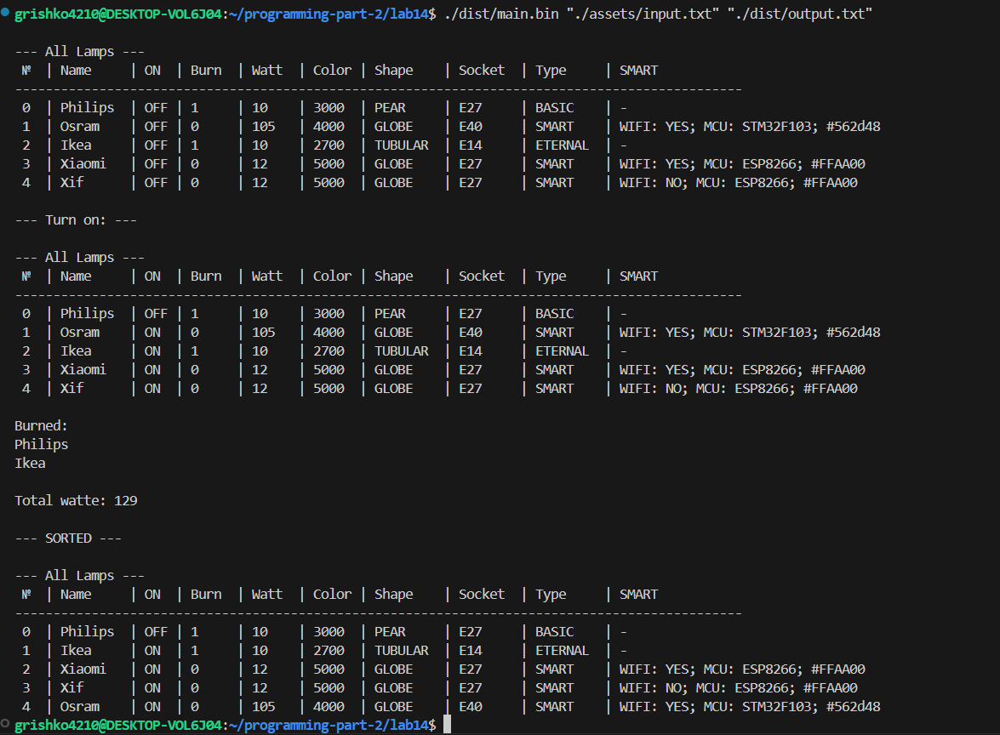
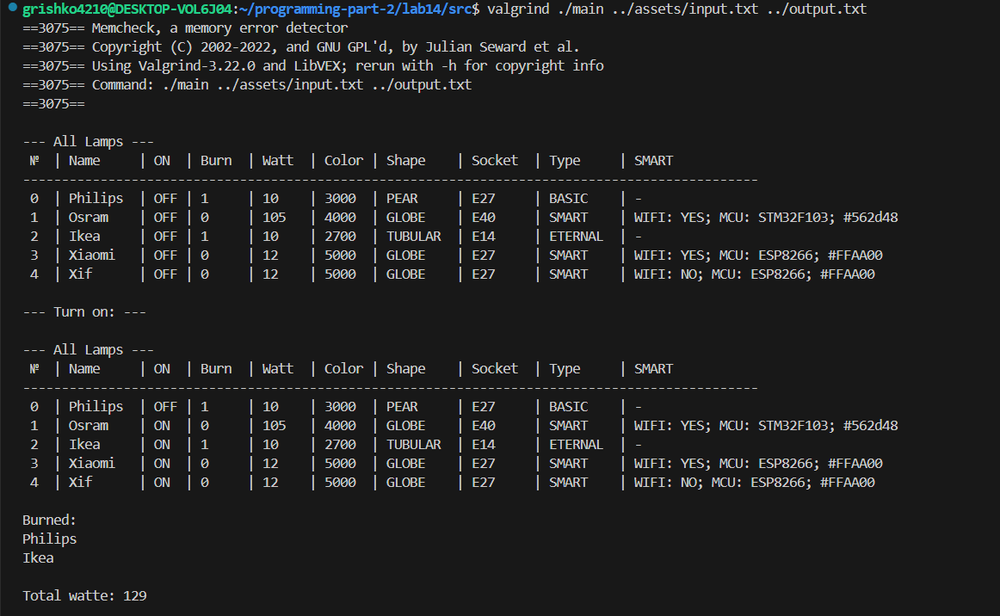
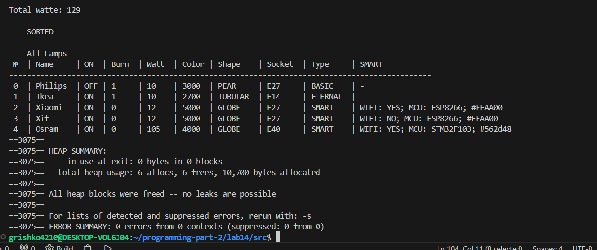
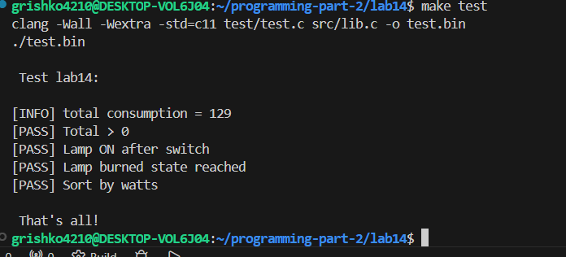

# Lab 14 — Lab Work Structured data types
 
---
**Course:** Programming, Part 2  
**Institution:** NTU KhPI, Kharkiv, Ukraine  
**Student:** Arina Hryshko  
**Date:** 2 May, 2026  
 
---
 
## Task Description
 
 From the section “Individual Tasks for Comprehensive Work,” select an application domain based on
the variant number according to a predefined formula
 Create a structure that represents the “base class”

 **My variant 20:**

 ```bash
Variant 20: 
Lamps
• Base class fields:
– Is the light bulb on? (e.g., yes, no)
– Has the light bulb burned out? (e.g., yes, no)
– Light bulb manufacturer (e.g., Horns and Hooves LLC)
– Number of times the light bulb has been turned on before burning out, countdown timer (e.g., 20,
250)
– Number of watts the light bulb consumes per hour (e.g., 5, 10, 15)
– Color temperature of the bulb (e.g., 1800, 6600)
– Shape (one from the list: Candle, Tubular, Globe, Pear, Ogive)
– Base type (one from the list: E14, E27, E40)
• Required method of the base class:
– Turn on the bulb (decreases the burnout counter; when the
counter reaches 0, sets the burnout flag)
• Subclass 1 - Smart Bulb. Additional fields:
– Whether wireless control is available (e.g., yes, no)
– Name of the microcontroller on which the bulb is based (one of the following:
STM32F103, ESP8266)
– Bulb glow color in HEX (e.g., #118038, #AC125E)
• Descendant 2 - Everlasting Bulb. Additional actions:
– Override the bulb-turning-on method so that the fields for the number of turns-on
before burnout and the burnout flag remain unchanged
• Methods for working with the collection:
1. Find burnt-out bulbs
2. Calculate total power consumption (W) excluding burnt-out bulbs
3. Select all smart bulbs

 ```
 
## Structure
 
```text
lab14/
├──Doxyfile/
├── Makefile/
├── README.md
├── assets/
|      └── input.txt
├── doc/
|      └── lab14.md
├── test/
|      └── test.c
├── src/
|     └── lib.c
|     └── lib.h
|     └── main.c
```

 
## Lab Instructions
 
Required Tasks
1. Develop a function that reads data (an array of elements) from a file;
2. Develop a function that writes data (an array of elements) to a file;
3. Develop a function that displays an array of elements on the screen;
4. Implement function #1 from the “Methods for Working with Collections” category, which takes
an array of objects as input. Note that all necessary data must be
passed as function arguments. For example, if you need to find all “Ford” cars,
the function must have a “car brand” argument, and in main(), call this function with
the desired brand value.
5. Develop a function that sorts an array of elements by a specified criterion (field);

 
### How to Build
 
```bash
make
./dist/main.bin "./assets/input.txt" "./dist/output.txt"
make clean
```
 
### How to Run Tests
 
```bash
make test
```
### Test Results



---

### Checking(valgrind):





---

### Test Results(test.c)
 
 

---
 

 
## Report
 
The goal of this lab is to work with structured data types in C, simulate a basic inheritance model using structures and practice file handling, sorting, filtering and modular programming.
 
In this lab, I completed the following tasks:
- Developed a structure representing a "Lamp" as a base entity with multiple fields(type, color, etc. )
- Implemented functions for: 
   - reading an array of structures from a file;
   - writing an array of structures to a file;
   - dispalaying an array of structures on the screen;
- Implemented a collection processing function to find burnt-out lamps;
- Implemented calculation of total watts consumption excluding burn-out lamps;
- Implemented sorting of lamps by selected criteria(field);
- Ensured that all data is passed using pointers as required;
-  Created and executed unit tests to verify functionality;
- Checked memory usage and ensured no memory leak using "Valgrind".
 
 
---
 

### Observations and Conclusion
 
Durinf the implementation of this laboratory work I gained practical experience in working with structured data typed and simulating object-oriented behavior in C using structures and functions.

I learned how to:
1. Manage dynamic collections of structures.
2. Pass data efficiently using pointers.
3. Design modular programs with separated logic in different files.
4. Validate program correctness using unit test.
5. Check memory safety using "Valgrind"

The implementation of "Smart Lamp" and "Enternal Lamp" helped to understand how different behaviors can be modeled using separate structures and function overriding techniques in C.
As a result, the program successfully performs all required operations and handles data correctly without memory leak.
 
 
---