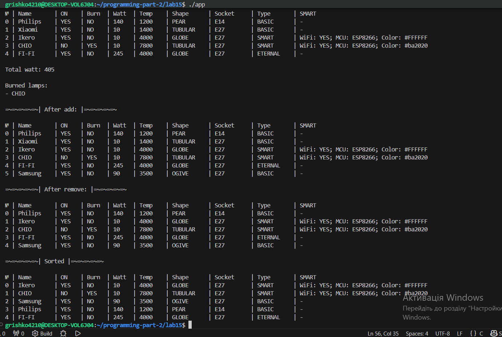
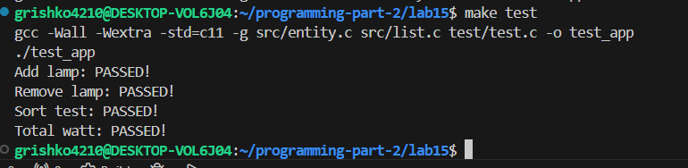
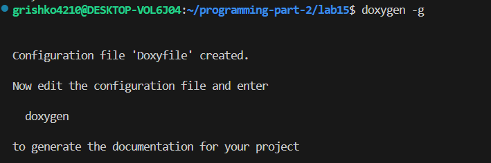
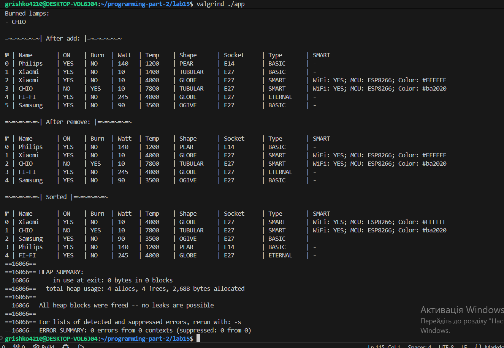

# Lab 15 — Lab Work Dynamic Array
 
---
**Course:** Programming, Part 2  
**Institution:** NTU KhPI, Kharkiv, Ukraine  
**Student:** Arina Hryshko 
**Date:** 06 May, 2026 
 
---
 
## Task Description
 
General Task:
Based on the previously developed functionality for working with the application domain, create
a dynamic array of elements of the developed structure. Implement the following functions for working with the list:
1. Display the contents of the list on the screen;
2. Implement function #1 from the “Methods for working with a collection” category (see the assignment from the course materials);
3. Add an object to the end of the list;
4. Remove an object from the list by index;
5. Sort the list contents by one of the criteria
 

**My variant 20:**

```bash
Variant 20: 
Lamps
• Base class fields:
– Is the light bulb on? (e.g., yes, no)
– Has the light bulb burned out? (e.g., yes, no)
– Light bulb manufacturer (e.g., Horns and Hooves LLC)
– Number of times the light bulb has been turned on before burning out, countdown timer (e.g., 20,
250)
– Number of watts the light bulb consumes per hour (e.g., 5, 10, 15)
– Color temperature of the bulb (e.g., 1800, 6600)
– Shape (one from the list: Candle, Tubular, Globe, Pear, Ogive)
– Base type (one from the list: E14, E27, E40)
• Required method of the base class:
– Turn on the bulb (decreases the burnout counter; when the
counter reaches 0, sets the burnout flag)
• Subclass 1 - Smart Bulb. Additional fields:
– Whether wireless control is available (e.g., yes, no)
– Name of the microcontroller on which the bulb is based (one of the following:
STM32F103, ESP8266)
– Bulb glow color in HEX (e.g., #118038, #AC125E)
• Descendant 2 - Everlasting Bulb. Additional actions:
– Override the bulb-turning-on method so that the fields for the number of turns-on
before burnout and the burnout flag remain unchanged
• Methods for working with the collection:
1. Find burnt-out bulbs
2. Calculate total power consumption (W) excluding burnt-out bulbs
3. Select all smart bulbs

```

## Structure
 
```text
lab15/
├──Doxyfile/
├── Makefile/
├── README.md
├── doc/
|      └── lab15.md
├── test/
|      └── test.c
├── src/
|     └──entity.c
|     └──entity.h
|     └── list.c
|     └── list.h
|     └── main.c
```

 
## Lab Instructions
 
1. The program must include documentation generated using the "doxygen" utility;
2. The report must be formatted in accordance with the “Requirements for the Report Structure”;
3. Demonstrate the absence of memory leaks using the "valgrind" utility;
4. Access array elements by dereferencing pointers, not through
the indexing operator ([ ]);
5. Demonstrate the operation of the developed methods using unit tests;
6. The report must specify the code coverage percentage achieved by unit tests. 50% is the minimum acceptable code coverage percentage.

### How to Build
 
```bash
make
./app
make clean
```
### Build Results


 
---
### How to Run Tests
 
```bash
make 
make test
```
### Test Results
 
 

---

### How build "doxygen" and Result:


 
---

### Memory leak check:



---

## Report
 
The goal of this lab is to practice working with dynamic arrays in the C programmin language. During the implementation of the laboratory work, a dynamic array of structures was created for storing information about lamps. Each lamp contains information about it's state, manufacturer, watt, color temperature, socket, type and additional smart lamp parameters.
 
In this lab, I completed the following tasks:
- Implemented a dynamic array of structures;
- Implemented adding a new lamp to the array;
- Implemented removing a lamp by index;
- Implemented sorting lamps by watt consumption;
- Implemented calculation of total watt consumption excluding burned lamps;
- Implemented searching for burned lamps;
- Implemented output of array contents to the console;
- Implemented support for smart lamps with additional information;
- Used pointer dereferencing instead of array indexing;
- Created unit tests for the implemented functions;
- Checked the program for memory leaks using "valgrind".

The program was successfully compiled and tested.

---
 
### Observations and Conclusion
 
During this laboratory work, I improved my practical skills in dynamic memory management and working with structures in the C programming language.

I learned how to:
- Dynamically allocate and free memory;
- Work with arrays using pointers;
- Implement sorting and collection-processing methods;
- Organize a project into separate modules;
- Create and run unit tests;
- Check programs for memory leaks.

The developed program correctly performs all required operations with the dynamic array of lamps. All implemented functions were successfully tested, and no memory leaks were detected. The laboratory work fully satisfies the given requirements.

---