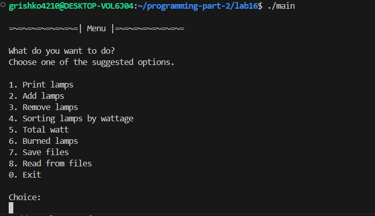
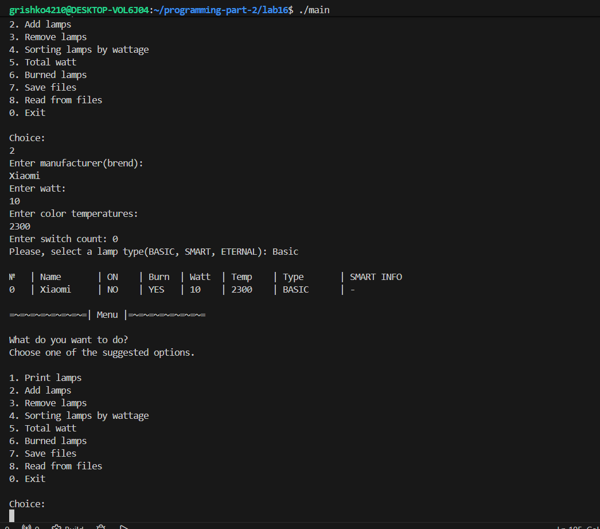
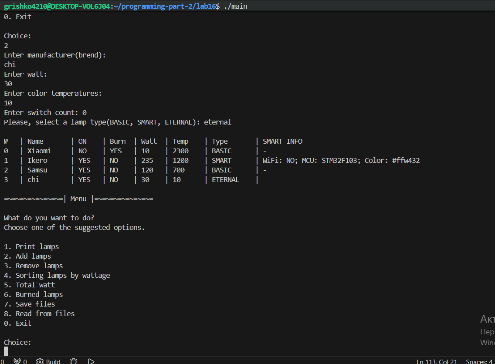
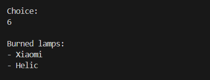
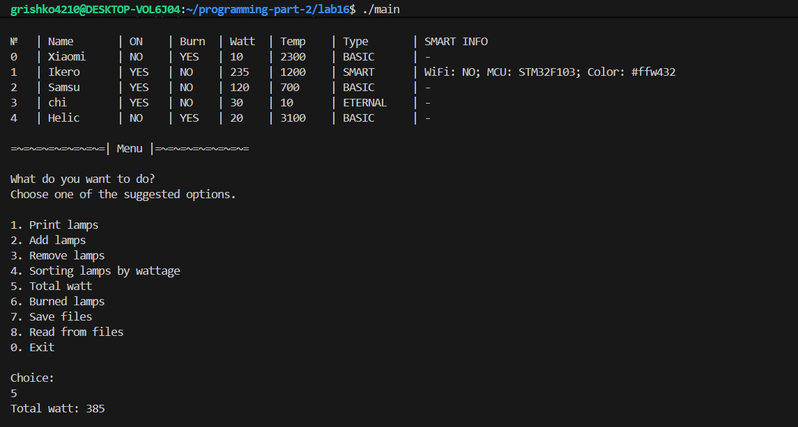
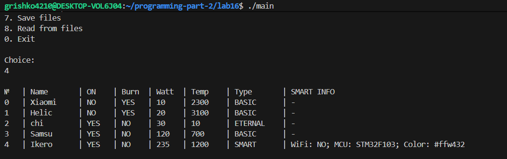
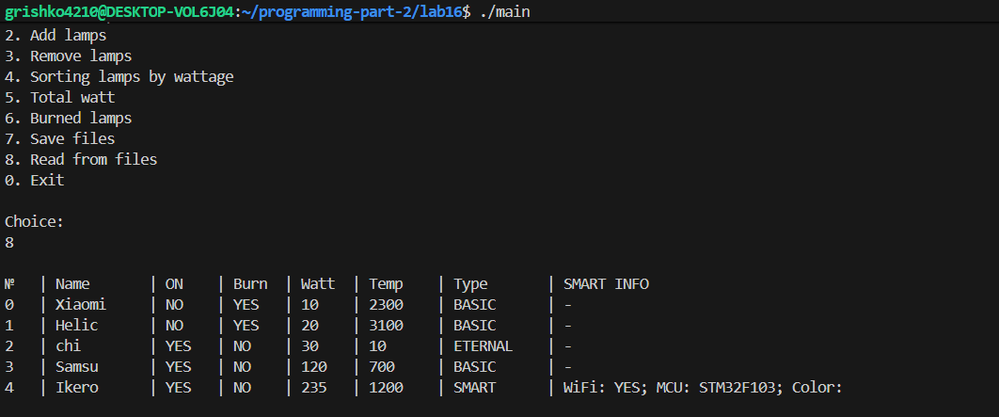
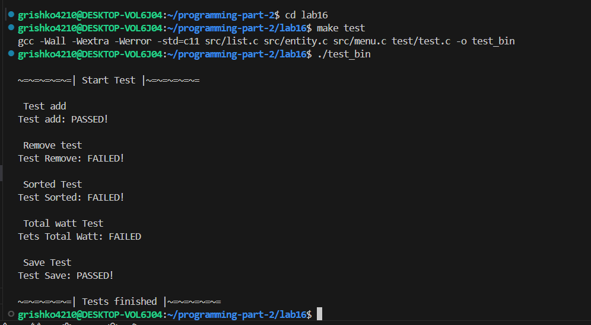
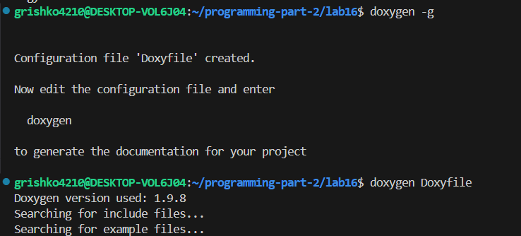
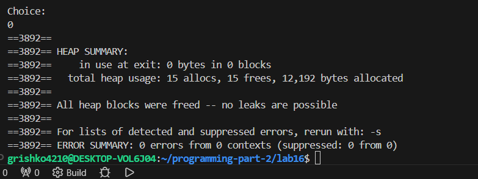

# Lab 16 — Lab Work Dynamic Lists
 
---
**Course:** Programming, Part 2  
**Institution:** NTU KhPI, Kharkiv, Ukraine  
**Student:** Arina_Hryshko  
**Date:** 08 May, 2026  
 
---
 
## Task Description
 
General Task
Based on the previously developed functionality for working with the application domain, create a singly linked list of elements from the developed structure. Implement the following functions
for working with the list:
- Reading data from a file using the fscanf function;
- Writing data to a file using the fprintf function;
- Displaying the list contents on the screen;
- Implementing function No. 1 from the “Methods for Working with Collections” category (see the assignment from the course materials);
- Adding an object to the end of the list;
- Removing an object from the list by index.
- Sort the contents of the list by one of the criteria
And also:
- Implement an interactive mode of communication with the user using a menu to
demonstrate the developed methods;
- Demonstrate the absence of memory leaks;
- Develop unit tests that demonstrate the correct operation of the implemented functions;
 
**My variant 20:**

```bash
Variant 20: 
Lamps
• Base class fields:
– Is the light bulb on? (e.g., yes, no)
– Has the light bulb burned out? (e.g., yes, no)
– Light bulb manufacturer (e.g., Horns and Hooves LLC)
– Number of times the light bulb has been turned on before burning out, countdown timer (e.g., 20,
250)
– Number of watts the light bulb consumes per hour (e.g., 5, 10, 15)
– Color temperature of the bulb (e.g., 1800, 6600)
– Shape (one from the list: Candle, Tubular, Globe, Pear, Ogive)
– Base type (one from the list: E14, E27, E40)
• Required method of the base class:
– Turn on the bulb (decreases the burnout counter; when the
counter reaches 0, sets the burnout flag)
• Subclass 1 - Smart Bulb. Additional fields:
– Whether wireless control is available (e.g., yes, no)
– Name of the microcontroller on which the bulb is based (one of the following:
STM32F103, ESP8266)
– Bulb glow color in HEX (e.g., #118038, #AC125E)
• Descendant 2 - Everlasting Bulb. Additional actions:
– Override the bulb-turning-on method so that the fields for the number of turns-on
before burnout and the burnout flag remain unchanged
• Methods for working with the collection:
1. Find burnt-out bulbs
2. Calculate total power consumption (W) excluding burnt-out bulbs
3. Select all smart bulbs

```

## Structure
 
```text
lab16/
├──Doxyfile/
├── Makefile/
├── README.md
├── doc/
|      └── lab16.md
├── test/
|      └── test.c
├── src/
|     └──entity.c
|     └──entity.h
|     └── list.c
|     └── list.h
|     └── menu.c
|     └── menu.h
|     └── main.c
```
 
## Lab Instructions
 
1. The program must include documentation generated using the Doxygen utility;
2. The report must be formatted in accordance with the “Requirements for Report Structure”;
3. Demonstrate the absence of memory leaks using the Valgrind utility;
4. Access array elements by dereferencing pointers, rather than using the indexing operator ([ ]);
5. Demonstrate the functionality of the developed methods using unit tests;
6. In the report, provide the code coverage percentage achieved by unit tests. 50% is the minimum acceptable
code coverage percentage.
 
### How to Build
 
```bash
make lab16
./main
make clean
```
### Build Results

*1.*


*2*


*3*


*4*


*5*


*6*


*7*


---
 
### How to Run Tests
 
```bash
make tests
./test_bin
make clean
```
### Test Results
 

 
--- 
### How build "doxygen" and Result:



---

### Memory leak check:



---
## Report
 
The goal of this lab is to implemented a singly linked list in C for managing a collection of lamp objects based on a predefined structure. The program supports different types of lamps(BASIC, SMART, ETERNAL) and provides functionality for fille, sorting and analysis of the collection.
 
In this lab, I completed the following tasks:
- Designed a Lamp structure with multiple attributes including type, watt, state and smart features.
- Implemented a singly linked list using dynamic memory allocation.
- Developed core operations for the list.
- Adding elements to the end of the list.
- Removing elements by index.
- Displaying all elements in a formatted table.
- Implemented sorting of lamps by wattage.
- Finding burned-out lamps.
- Calculating total power consumption excluding burned-out lamps.
- Handling smart lamp filtering and information display
- Implemented an interactive menu-driven interface for user interaction.
- Created unit tests to verify correctness of core functions.
- Ensured proper memory management and verified absence of memory leaks using "Valgrind"
- Structured the project according to modular programming principles (separate list, entity, menu, main modules).

---
 
### Observations and Conclusion

*Observations:*
During the implementation of this lab, I gained a deeper understanding of dynamic memory management in C and the behavior of singly linked lists. One of the key challenges was correctly synchronizing data between file storage and runtime structures, especially when reconstructing object states from a file. I also observed that: Proper file formatting is critical — incorrect formatting in "fprintf/fscanf" can lead to missing or corrupted data after loading.
Logical state fields (such as is_on and is_burned) must be recalculated after reading from a file to ensure consistency.
Sorting linked lists requires swapping node data rather than modifying pointers, which simplifies implementation but may be less efficient for large datasets.
Menu-driven programs improve usability but require careful input validation to avoid unexpected behavior.
 
*Conclusion:*
Overall, this lab strengthened my skills in C programming, especially in working with pointers, dynamic memory, and modular program design. It also improved my understanding of how to design maintainable and testable code for real-world-like data structures.
 
---